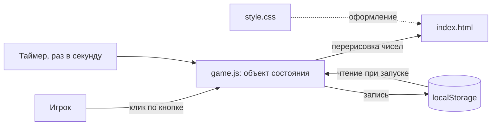

# ARCHITECTURE.md — как устроено и почему

> Состояние на 10.08.2026: три файла созданы, работают три функции — кнопка и счётчик, автоматический прирост раз в секунду, покупка дорожающего улучшения. Сохранения в коде пока нет: описанное ниже про `localStorage` — замысел, а не текущий код. Документ обновляется по мере появления функций.

## Общая идея

Игра целиком выполняется в браузере на компьютере игрока. Никакого сервера, никакой сборки, никакого интернета. Всё, что нужно для запуска, — три файла на диске.

Причина такого выбора одна и она не техническая: владелец проекта не программирует. Каждая «движущаяся часть» — сборщик, менеджер пакетов, сервер — это то, что однажды сломается и остановит проект насовсем. Поэтому их нет.

## Компоненты

| Компонент | Ответственность | С чем общается |
|---|---|---|
| `src/index.html` | Что видно на экране: заголовок, места для чисел, кнопки | Подключает `game.js` и `style.css` |
| `src/game.js` | Состояние игры, обработка клика, тик раз в секунду, покупка улучшения, чтение и запись сохранения | Меняет содержимое элементов в `index.html`, пишет и читает `localStorage` |
| `src/style.css` | Внешний вид | Ничего не знает про логику |
| `localStorage` браузера | Хранит состояние между запусками | Только через `game.js` |

Разделение на три файла выбрано не ради чистоты, а ради навигации: когда что-то не так с внешним видом — смотрим в `style.css`, когда с поведением — в `game.js`. Искать по одному большому файлу человеку без опыта тяжело.

## Поток данных

Читается так: и клик игрока, и тик таймера делают одно и то же — меняют объект состояния. После любого изменения состояние показывается на экране и записывается в хранилище браузера. При следующем открытии игра начинает с чтения того же хранилища.

Ключевое свойство: **состояние одно и живёт в одном месте.** Числа на экране — не источник истины, а отражение состояния. Это избавляет от целого класса ошибок, когда на экране одно, а в памяти другое.

## Модель данных

| Сущность | Ключевые поля | Связи |
|---|---|---|
| Состояние игры | `ресурс`, `приростВСекунду`, `ценаУлучшения`, `купленоУлучшений`, `версияСохранения` — всё числа | Единственный объект, целиком пишется в `localStorage` |

Поле `версияСохранения` существует ради требования F8: если версия не совпала, сохранение отбрасывается осознанно и игрок видит сообщение, а не белый экран. В коде его пока нет — появится вместе с сохранением.

Отдельной сущности «улучшение» не завелось, хотя в первоначальном замысле она была. Цена живёт прямо в состоянии полем `ценаУлучшения` и удваивается при каждой покупке. Так вышло проще: правило роста цены — одна строка в функции покупки, а не таблица параметров. Вернуться к отдельной сущности придётся, когда улучшений станет больше одного.

`купленоУлучшений` на экране не показывается и на игру пока не влияет. Поле заведено ради сохранения: без него после перезагрузки нельзя будет восстановить, сколько покупок сделано.

## Чего в архитектуре нет и почему

- **Сборки и зависимостей** — некому чинить, если сломается.
- **Сервера и базы данных** — игре не с чем общаться, игрок один.
- **Автоматических тестов** — при трёх файлах и одном пользователе проверка руками занимает минуту, см. `PROJECT.md`, раздел 3.6.
- **Разделения `game.js` на модули** — пока делить нечего. Вернуться, когда файл перестанет читаться за один экран.

## Журнал изменений архитектуры

| Дата | Что изменилось | Почему |
|---|---|---|
| 09.08.2026 | Зафиксирована исходная архитектура | Планирование по `PROJECT.md`, раздел 3.2 |
| 10.08.2026 | Появилась покупка. В `index.html` — вторая кнопка, цену внутрь неё пишет `game.js`. В состоянии — `ценаУлучшения` и `купленоУлучшений`. Стартовая скорость изменена с 1 на 0: до первой покупки само ничего не растёт, это осознанная отмена части задачи 02. Нехватка очков показывается выключенной кнопкой, но главная проверка стоит внутри функции покупки — на выключенную кнопку полагаться нельзя, это подсказка глазу, а не защита. Отдельной сущности «улучшение» не завелось: правило роста цены оказалось одной строкой | Задача 03 |
| 10.08.2026 | Появился тик. В состоянии — поле `приростВСекунду` (пока всегда 1), в коде — функция `тик` и вызов `setInterval(тик, 1000)`. Скорость вынесена в состояние отдельным полем заранее: задача про улучшение сведётся к увеличению этого числа, а не к переписыванию таймера. Отвергнут вариант «замерять реально прошедшее время»: точнее, но тянет дробные числа и по сути является половиной оффлайн-прогресса из версии 2. Принятое следствие: **в свёрнутой вкладке браузер сам замедляет таймер**, прирост отстаёт — это поведение браузера, не ошибка игры. Клик и тик не конфликтуют: JavaScript выполняет действия по одному за раз | Задача 02 |
| 09.08.2026 | Появились три файла. В `game.js` живут: объект `состояние` с полем `ресурс`, функция `показатьСостояние` и функция `нажатьКнопку`. Правило «состояние меняется → сразу перерисовываем экран» соблюдено с первой функции | Задача 01. Элементы страницы ищутся один раз при запуске, скрипт подключён в конце `index.html` — иначе кнопки ещё не существует к моменту запуска скрипта |
