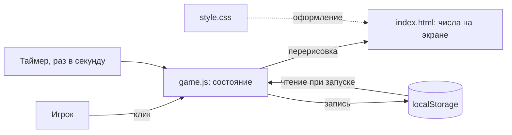

# Паспорт проекта (разработка)

> Заполнен по итогам интервью 09.08.2026. Живёт в корне проекта как `PROJECT.md`.
> Правило: пустой раздел лучше, чем раздел с водой. Пометка `[уточнить: …]` означает, что ответа пока нет честно.

| Поле | Значение |
|---|---|
| Название проекта | Инкрементальная игра *(рабочее)* — `[уточнить: название, после скелета]` |
| Дата старта | 09.08.2026 |
| Владелец | Vitalii |
| Репозиторий | `[уточнить: создать публичный на GitHub в первой сессии]` |
| Статус | планирование |
| Дата последнего пересмотра документа | 09.08.2026 |

---

## Часть 0. Ответ в одну строку

- **Что делаем:** собираем простую инкрементальную игру в браузере — чтобы на живом проекте отладить собственную схему запуска и ведения проектов вместе с Claude.
- **Зачем:** Vitalii не программирует. Нужен рабочий способ доводить проекты до конца с ИИ: документация, задачи, git, повторяемый цикл функции. Игра — полигон, а не цель.
- **Когда проект считается законченным:** когда Vitalii самостоятельно, без подсказок, разворачивает по этой же схеме **второй, другой** проект и доводит его до первой рабочей функции.

---

## Часть 1. Этап планирования

### 1.1 Цель и результат

**Тип проекта:**

- [ ] Тест идеи
- [ ] Прототип
- [ ] Проверка работоспособности функции / технический спайк
- [x] **Освоение технологии.** Цель — научиться. Результат — навык и заметки, а не продукт.
- [ ] Внутренний инструмент
- [ ] Продукт в эксплуатацию

Осваиваемая технология — **работа с Claude и агентами**: ведение проекта через документы, задачи и git. Не язык программирования.

Следствие, о котором договорились вслух: код может быть местами грязным, но **не может быть непонятным**. Vitalii не сможет отладить то, чего не понимает, — поэтому простота кода здесь не эстетика, а условие выживания проекта.

**Какого конкретно результата хочу достичь:**

> К концу проекта у меня есть отредактированная схема запуска проекта в виде комплекта документов (`PROJECT.md`, `CLAUDE.md`, `STATUS.md`, `CHANGELOG.md` + правило цикла функции), обкатанная на живом проекте, — и инкрементальная игра, которая открывается в браузере двойным кликом и в которую можно играть.

**Что я узнаю или получу, даже если проект провалится:**

> Понимание, из чего состоит проект: зачем нужен каждый файл, что такое коммит и откат, почему сессия теряет контекст. Плюс поднятый и работающий git. Плюс список мест, где схема ломается, — сам по себе ценный результат для следующей попытки.

**Что точно НУЖНО сделать:**

1. Поднять git и публичный репозиторий на GitHub, научиться откатывать состояние.
2. Создать комплект документов схемы и провести через полный цикл (задача → план → код → тест → журнал) не менее 5 функций.
3. Довести игру до состояния: счётчик ресурса, кнопка добычи, одно дорожающее улучшение с автоприростом, сохранение прогресса.

**Что точно НЕ делаем:**

| Не делаем | Почему сейчас нет | Вернуться к вопросу когда |
|---|---|---|
| Сеттинг, названия, тема игры | Уводит в творчество вместо схемы | После скелета |
| Баланс и кривые роста чисел | Отдельная большая тема, съест весь бюджет времени | Версия 2 |
| Десятки улучшений | Не дают ни одного нового цикла обучения, только копипаста | Версия 2 |
| Пороговый автоприрост: скорость растёт сама от накопленного ресурса, потолок, надпись «Вы прошли игру» | Идея Vitalii от 10.08.2026. Обесценивает покупное улучшение из MVP и требует балансировки чисел, которая отложена | Версия 2 |
| Престиж / перерождение | Самая сложная механика жанра | Версия 2 |
| Оффлайн-прогресс | Требует работы со временем и датами — типичный источник трудноуловимых ошибок | Версия 2 |
| Графика, анимация, звук | Не проверяют схему ничем | Версия 2 |
| Мобильная вёрстка | Один пользователь, один компьютер | Версия 2 |
| Публикация через GitHub Pages | Не влияет на критерий успеха | После MVP |
| Сборка, npm, фреймворки, сервер, база данных | Новичок не отладит, а поломка остановит проект насовсем | Не в этом проекте |
| Аккаунты, онлайн-сохранения, таблицы рекордов | Требуют бэкенда | Не в этом проекте |
| Автоматические тесты | При 3–5 часах в неделю не окупаются; проверяем руками по чек-листу | Если проект перерастёт MVP |

**Критерий успеха (измеримый):**

| Что меряем | Как меряем | Целевое значение |
|---|---|---|
| Второй запуск без подсказок | Vitalii разворачивает второй, другой проект по этой схеме сам; наблюдаем, дошёл ли до первой рабочей функции, ни разу не спросив «а что дальше» | Дошёл |
| Функции, прошедшие полный цикл | Считаем записи в `CHANGELOG.md` и коммиты в git | Не менее 5 |
| Игра запускается | Открыть `index.html`, поиграть 10 минут, купить улучшение, закрыть и открыть заново | Прогресс на месте |

**Что будет с проектом после достижения цели:** `[уточнить: пока не знаю — решить в момент, когда критерий будет достигнут]`

### 1.2 MVP — минимально жизнеспособная версия

**Одна задача, которую MVP решает от начала до конца:**

> Довести инкрементальную игру от пустой папки до состояния «открывается в браузере и в неё можно играть» — целиком по схеме, через задачи, документы и git, не срезая углы.

**Сценарий демонстрации:**

1. Я открываю папку проекта — вижу `CLAUDE.md`, `PROJECT.md`, `STATUS.md`, `CHANGELOG.md` и папку с игрой.
2. Двойным кликом открываю `index.html` в браузере.
3. Жму кнопку — счётчик ресурса растёт на 1.
4. Накопив 10, покупаю улучшение: оно дорожает, и ресурс начинает капать сам, без кликов.
5. Закрываю вкладку, открываю снова — прогресс на месте.
6. Открываю `CHANGELOG.md` и вижу, что каждая из этих функций появилась отдельной записью, а в истории git — отдельным коммитом.

И это значит, что задача решена, потому что схема прошла проверку боем на живом проекте, а не осталась текстом.

**Состав MVP:**

| Функция | Зачем она в MVP | Обязательна? | Что сломается без неё |
|---|---|---|---|
| Счётчик ресурса на экране | Без него нечего показывать | must | Не видно результата действий |
| Кнопка «добыть» (+1 за клик) | Первое действие игрока | must | Игры нет вообще |
| Улучшение, дорожающее с каждой покупкой | Это и есть суть жанра | must | Остаётся просто кликер |
| Автоприрост: тик раз в секунду | Ради него улучшение и покупают | must | Покупка ничего не меняет |
| Сохранение прогресса в браузере | Инкрементальная игра без накопления не проверяется как игра | must | Каждый запуск с нуля, играть бессмысленно |
| Показ скорости «в секунду» | Приятно, но ничего не ломает | nice | Ничего — едет в версию 2 |

**Откладываем до версии 2:** сеттинг и названия, баланс чисел, много улучшений, престиж, оффлайн-прогресс, показ скорости, публикация через GitHub Pages, мобильная вёрстка.

**Чем осознанно жертвуем в MVP:** красотой интерфейса (голый HTML без оформления), балансом чисел (значения берём наугад), обработкой редких ошибок, мобильной вёрсткой, автоматическими тестами.

### 1.3 Три главных вопроса

| # | Вопрос | Почему он критичен | Как проверим (дешёвый эксперимент) | Ответ | Статус |
|---|---|---|---|---|---|
| 1 | Как проверить, что код делает заявленное, если я его не читаю? | Без ответа стадия «тестирование» в цикле — фикция, и схема будет отлажена неправильно | На первой же функции заранее записать в задачу три проверки, выполняемые руками в браузере: жму — растёт на 1; жму десять раз — ровно десять; перезагружаю — начинается заново. Провести их. Один вечер | **Да.** Задача 01, 09.08.2026: восемь проверок записаны до кода и пройдены руками, в `game.js` заглядывать не пришлось ни разу. Оговорка: список составил Claude, Vitalii его принял без правок — значит проверена сама процедура приёмки, но не умение владельца формулировать проверки. Это переносится на задачу 02 | закрыт |
| 2 | Хватит ли `STATUS.md`, чтобы новая сессия продолжила с нужного места? | Это главная проверяемая гипотеза всей схемы: если контекст не передаётся, схема не работает | После первой готовой функции закрыть сессию, начать новую с нуля, дать только `CLAUDE.md` и `STATUS.md` и фразу «продолжай». Считается пройденным, если новая сессия сама назвала следующий шаг и не переспрашивала про прошлое. 30 минут | **Да.** 10.08.2026: сессия начата с нуля, дано одно слово «продолжай». Claude прочитал `STATUS.md`, сам назвал следующий шаг — задачу 02 с двумя её долгами — и ничего не переспрашивал про прошлое. Оговорка: `STATUS.md` был написан в конце предыдущей сессии подробно и по свежим следам; гипотеза проверена для аккуратно заполненного файла, а не для любого | закрыт |
| 3 | Окупаются ли задачи, ветки и четыре документа на проекте из трёх файлов? | Если ритуал тяжелее проекта, схему надо иметь в двух размерах — лёгком и полном | На первых трёх функциях засекать время отдельно на код и отдельно на документы с задачами. Если бумага съедает больше половины — схему для мелких проектов упрощаем. Отдельного эксперимента не требует, замер идёт по ходу | | открыт |

Вопросы, которые обсуждались, но признаны **не** рисками:

- *Подняты ли инструменты* — задача на час, ушла в сетап-чеклист (часть 4).
- *Бюджет времени* — не гипотеза, а ограничение, ушло в допущения (1.4).
- *Хватит ли трёх файлов без сборки* — ушло в допущения, проверяется на функции «сохранение».
- *Есть ли кандидат на второй проект* — вопрос без срочности, вернуться к нему при закрытии MVP.

Правило: пока хотя бы один вопрос открыт, крупную реализацию не начинаем.

### 1.4 Допущения и риски

| Допущение | Что будет, если оно неверно | Как проверить заранее |
|---|---|---|
| 3–5 часов в неделю реально находятся | Проект растянется, схема забудется между сессиями, критерий не проверить | Замерить по факту через 3 недели: сколько сессий состоялось |
| ~~Claude может выполнять git-команды на машине через мост~~ | **Проверено 09.08.2026 — допущение неверно.** Терминала этой машины у Claude нет, коннектора к GitHub тоже. Решение: git стоит у Vitalii, Claude выдаёт готовые команды строкой, Vitalii копирует их в терминал VS Code | Закрыто |
| ~~Файлы переносятся между облаком и диском вручную и ничего не теряется~~ | **Уточнено 09.08.2026 — риск снят.** Папка проекта подключена к сессии, Claude правит файлы на диске напрямую, ручной перенос не нужен. Осталась прежняя дисциплина: незакоммиченная правка — беззащитная | Закрыто |
| Трёх файлов (`index.html`, `game.js`, `style.css`) хватит до конца MVP | Придётся вводить сборку, которую новичок не отладит | Проверить на функции «сохранение» — самой требовательной из MVP |
| Документация не съест больше половины времени | Схему придётся упростить и держать в двух размерах | Вопрос №3 в 1.3 |
| Vitalii сможет сформулировать проверки функции своими словами | Приёмка станет формальной, схема отладится неправильно | **Не проверено на задаче 01:** список писал Claude по выбору Vitalii. Переносится на задачу 02, где проверки пишет владелец, а Claude только записывает |

---

## Часть 2. Требования к продукту

### 2.1 Для кого

| Кто | Контекст использования | Что для него важнее всего |
|---|---|---|
| Vitalii в роли ученика | Сессии по 1–2 часа, 3–5 часов в неделю, за компьютером с браузером и редактором | Понимать, что происходит, и не застревать. Возвращаться после перерыва без потери контекста |
| Vitalii в роли игрока | Он же, но проверяет результат руками | Что игра открывается и реагирует на действия |

Сторонних пользователей нет и в этом проекте не планируется.

### 2.2 Какую проблему решаем — глазами пользователя

**Как происходит сейчас:**

> Появляется идея проекта → сажусь → не знаю, с чего начать → делаю наугад, что придёт в голову → через неделю не помню, где остановился и почему сделал именно так → начинаю заново или бросаю. Проект затухает за 2–3 недели, результата нет.

**Как будет происходить:**

> Открываю папку → читаю `STATUS.md` → вижу, чем закончил и что делаю следующим шагом → одна сессия = одна функция, прошедшая полный цикл → в конце сессии обновляю журнал и статус. Возврат к проекту после недельного перерыва стоит 5 минут чтения вместо часа воспоминаний.

Разница между этими двумя описаниями и есть ценность проекта. Игра в ней не участвует — она материал.

### 2.3 Пользовательские сценарии

| # | Сценарий | Приоритет | Входит в MVP |
|---|---|---|---|
| 1 | Как ученик, я хочу открыть проект после перерыва и за 5 минут понять, где остановился, чтобы не терять сессию на восстановление контекста | must | да |
| 2 | Как ученик, я хочу проверить готовую функцию руками по заранее записанному чек-листу, чтобы не принимать код вслепую | must | да |
| 3 | Как ученик, я хочу откатить сломанное состояние на последнее рабочее, чтобы одна ошибка не убивала проект | must | да |
| 4 | Как игрок, я хочу нажимать кнопку и видеть, как растёт число, чтобы игра была игрой | must | да |
| 5 | Как игрок, я хочу купить улучшение и увидеть, что ресурс растёт сам | must | да |
| 6 | Как игрок, я хочу вернуться позже и продолжить с накопленным | must | да |
| 7 | Как ученик, я хочу выложить игру по ссылке и показать её | could | нет |

### 2.4 Пользовательский путь по основному сценарию

1. Открываю папку проекта в проводнике.
2. Двойным кликом запускаю `index.html` — открывается вкладка браузера.
3. Вижу заголовок, число «Ресурс: 0» и кнопку «Добыть».
4. Жму кнопку — число становится 1, потом 2, потом 3.
5. Вижу блок улучшения: название, текущую цену, кнопку «Купить». Пока ресурса мало, кнопка неактивна.
6. Накопив нужное количество, жму «Купить» — ресурс уменьшается на цену, цена улучшения растёт, появляется строка «Уровень: 1».
7. Перестаю кликать — число всё равно растёт само, раз в секунду.
8. Закрываю вкладку. Открываю `index.html` снова — вижу свой ресурс и уровень улучшения на месте.

**Что происходит, когда что-то идёт не так:**

- Сохранение повреждено или от старой версии игры → игра стартует с нуля и показывает строку «Сохранение не прочитано, начинаем заново» вместо белого экрана.
- Браузер запрещает сохранение (открыто в приватном окне) → игра работает, но показывает предупреждение, что прогресс не сохранится.
- Файл открыт не полностью (нет `game.js`) → на странице видно сообщение об ошибке, а не пустой белый лист.

### 2.5 Функциональные требования

| # | Требование | Как проверить | Приоритет |
|---|---|---|---|
| F1 | Игра открывается двойным кликом по `index.html`, без сервера и без интернета | Отключить интернет, открыть файл — игра работает | must |
| F2 | На экране виден текущий ресурс числом | Открыть — видно «Ресурс: 0» | must |
| F3 | Клик по кнопке «Добыть» увеличивает ресурс ровно на 1 | Нажать 10 раз — ровно 10, не 9 и не 11 | must |
| F4 | Улучшение можно купить только при достаточном ресурсе | При нехватке кнопка неактивна и в минус ресурс не уходит | must |
| F5 | После покупки цена следующего улучшения выше предыдущей | Купить дважды, сравнить показанные цены | must |
| F6 | При уровне улучшения ≥ 1 ресурс растёт сам раз в секунду | Купить одно улучшение, убрать руки, подождать 10 секунд — ресурс вырос | must |
| F7 | Прогресс сохраняется и восстанавливается при повторном открытии | Накопить, закрыть вкладку, открыть заново — числа те же | must |
| F8 | Испорченное сохранение не роняет игру | Испортить сохранение вручную, открыть — игра стартует с нуля и сообщает об этом | must |

### 2.6 Нефункциональные требования

| Аспект | Требование |
|---|---|
| Скорость отклика | Клик отражается на экране мгновенно; автоприрост — раз в секунду |
| Объём данных | Одно сохранение, единицы килобайт |
| Одновременные пользователи | 1 |
| Приватность и чувствительные данные | Персональных данных нет. Всё хранится в браузере, наружу ничего не отправляется |
| Доступность / время работы | Файл на диске, интернет не требуется |
| Устройства и браузеры | Настольный компьютер, актуальный Chrome. Остальное не проверяем |
| Язык интерфейса | Русский |

### 2.7 Чем продукт НЕ является

> Это не полноценная инкрементальная игра со сбалансированной прогрессией и не продукт для сторонних игроков. Это учебный полигон, на котором проверяется схема ведения проектов с Claude. Если встанет выбор «улучшить игру» или «улучшить схему» — выбираем схему.

---

## Часть 3. Технические требования

### 3.1 Технологический стек

| Слой | Выбор | Почему именно это | Что рассматривали ещё |
|---|---|---|---|
| Язык | HTML + CSS + JavaScript | Всё выполняет браузер: ничего не надо устанавливать, ничего не надо собирать. Код читается новичком построчно | Python + Pygame (нужна установка и запуск из консоли), Godot (пришлось бы осваивать ещё и редактор) |
| Фронтенд-фреймворк | Нет, чистый DOM | React и Vue требуют сборки — это движущаяся часть, которую Vitalii не сможет починить | React, Vue |
| Бэкенд-фреймворк | Нет | Игре не с чем общаться | — |
| База данных | `localStorage` браузера | Нужно сохранить один небольшой объект. Ноль настройки, ноль установки | Файл на диске (браузер не даёт), сервер с базой (несоразмерно) |
| Хостинг / развёртывание | Локальный файл на диске. Позже — GitHub Pages | Для MVP хостинг не нужен вовсе | — |
| Аутентификация | Нет | Один пользователь, данных нет | — |
| Внешние API и сервисы | Нет | Ни один сценарий их не требует. Значит, нет и секретов | — |
| Фоновые задачи / расписание | `setInterval` раз в секунду внутри страницы | Единственный фоновый процесс в проекте — тик автоприроста | — |
| Мониторинг и логи | Консоль браузера (F12) | Для одного пользователя достаточно | — |
| Контроль версий | git + публичный репозиторий на GitHub | Прямо требуется критерием успеха: история коммитов — способ доказать, что функции шли по циклу. Плюс откат как страховка | Локальный git без GitHub, работа без git |
| Учёт задач | GitHub Issues | Задачи лежат рядом с кодом, у каждой записано, что не так и как проверить | Файл `TASKS.md` |

Критерии выбора, которыми пользовались: знакомость важнее моды, меньше движущихся частей важнее гибкости, и отдельно для этого проекта — **читаемость новичком важнее правильности**.

### 3.2 Архитектура

| Компонент | Ответственность | С чем общается |
|---|---|---|
| `index.html` | Что видно на экране: заголовок, числа, кнопки | Подключает `game.js` и `style.css` |
| `game.js` | Состояние игры, обработка клика, тик раз в секунду, покупка улучшения, чтение и запись сохранения | Меняет содержимое элементов в `index.html`, пишет в `localStorage` |
| `style.css` | Внешний вид | — |
| `localStorage` | Хранит состояние между запусками | Читается и пишется из `game.js` |

**Поток данных по основному сценарию:** клик игрока или тик таймера → изменение объекта состояния в `game.js` → перерисовка чисел в `index.html` → запись состояния в `localStorage` → при следующем открытии состояние читается оттуда обратно.

**Схема:**



### 3.3 Модель данных

| Сущность | Ключевые поля | Связи |
|---|---|---|
| Состояние игры | `ресурс` (число), `уровеньУлучшения` (число), `версияСохранения` (число) | Единственный объект, целиком пишется в `localStorage` |
| Улучшение | `базоваяЦена`, `множительРостаЦены`, `приростВСекунду` | Пока задано прямо в коде, не хранится в сохранении |

Поле `версияСохранения` нужно для требования F8: если версия не та, сохранение отбрасывается осознанно, а не роняет игру.

### 3.4 Внешние зависимости и секреты

Внешних сервисов нет. Секретов нет. Файл `.env` в этом проекте **не нужен** — записано явно, чтобы не создавать его по привычке.

### 3.5 Среды

| Среда | Где работает | Данные | Кто имеет доступ |
|---|---|---|---|
| Локальная | Файл на диске, открывается в браузере | Реальные (они же единственные) | Vitalii |
| Продуктивная | Нет. Позже возможен GitHub Pages | — | — |

### 3.6 Тестирование

- **Что покрываем обязательно:** каждое требование из 2.5 — ручной проверкой, записанной в задачу **до** написания кода.
- **Что не покрываем осознанно:** автоматические тесты. При 3–5 часах в неделю и трёх файлах кода они съедят бюджет, который нужен на схему.
- **Как запускается проверка (одно действие):** открыть `index.html` в браузере и пройти чек-лист из задачи.
- **Что считается пройденной проверкой перед коммитом:** игра открывается без ошибок в консоли, и все пункты чек-листа текущей задачи выполнены руками.

### 3.7 Осознанный технический долг

| Что делаем «неправильно» | Почему это допустимо сейчас | Когда возвращаемся |
|---|---|---|
| Нет автоматических тестов | Проект из трёх файлов, один пользователь, проверка руками занимает минуту | Если появится больше пяти механик |
| Числа (цены, приросты) зашиты прямо в код | Баланс вынесен за скобки MVP | Версия 2, вместе с балансом |
| Нет миграции старых сохранений — они просто отбрасываются | Игрок один, терять нечего | Если игру увидит кто-то кроме Vitalii |
| Вся логика в одном файле `game.js` | Разделять пока нечего, а лишние файлы усложняют навигацию новичку | Когда `game.js` перестанет читаться за один экран |

---

## Часть 4. Сетап-чеклист

Конкретные задачи под этот проект. Выполняются до первой функциональной задачи.

### Обязательное

- [x] **1. Проверить мост.** ~~Убедиться, что Claude может выполнять команды на машине Vitalii.~~ **Проверено 09.08.2026: моста нет, но папка подключена.** Режим работы: файлы Claude правит на диске напрямую, ручной перенос не нужен; команды в терминале Vitalii выполняет сам по готовым строкам.
- [x] **2. Установить git.** Скачать и установить, проверить, что команда `git` отвечает. Настроить имя и почту. *Выполняет Vitalii по инструкции.* **Сделано 09.08.2026.**
- [x] **3. Создать аккаунт GitHub** *(делает Vitalii лично — пароли и регистрация)*. Создать **публичный** репозиторий, связать с локальной папкой. **Сделано 09.08.2026:** https://github.com/otslovapremiya-art/Pet-project-
- [x] **4. Сделать первый коммит и один тестовый откат.** Не для галочки: сломать что-нибудь нарочно и вернуть обратно, чтобы страховка была проверена, а не только настроена. **Сделано 09.08.2026:** коммит `733f9ab`; откат проверен дважды — файл испорчен и возвращён, затем удалён и возвращён.
- [x] **5. `.gitignore`.** Минимальный: системный мусор Windows. `.env` в проекте нет и не будет — см. 3.4.
- [x] **6. `CLAUDE.md`.** Содержит: чем является проект (3 строки), как запустить игру, договорённости по стилю кода (**«пиши так, чтобы новичок прочёл»**), что нельзя трогать, ссылки на остальные документы. **Не** содержит пересказ архитектуры и историю изменений — для них есть отдельные файлы.
- [x] **7. `ARCHITECTURE.md`** — раздел 3.2 этого документа, дальше живёт своей жизнью.
- [x] **8. `STATUS.md`** — где мы сейчас, чем закончили прошлую сессию, что следующим шагом. Главный файл схемы: именно он проверяется вопросом №2.
- [x] **9. `CHANGELOG.md`** — журнал изменений, по записи на функцию. Он же доказательство критерия успеха.
- [x] **10. Шаблон задачи.** Три поля: что не так / как должно быть / **как проверить руками**. Третье поле обязательно — это ответ на вопрос №1.

**Часть 4 закрыта 09.08.2026.** Дальше — шаг 1 плана, спайк «приёмка вслепую».

### Субагенты и расширения — что нужно именно здесь

- [ ] **Субагент журнала изменений** — пишет записи в `CHANGELOG.md`, чтобы это не забывалось в конце сессии, когда силы кончились. *Нужен.*
- [ ] **Субагент ретроспективы** — после сессии разбирает, что мешало, и обновляет `CLAUDE.md`. *Нужен: это и есть механизм «отладки схемы», ради которого затеян проект.*
- [ ] **Субагент тестирования интерфейса** — прогоняет чек-лист в браузере автоматически. *Не нужен в MVP:* проверять руками — часть обучения, и именно эта проверка отвечает на вопрос №1.
- [ ] **Скилл фронтенд-дизайна** — *не нужен:* красотой интерфейса мы осознанно жертвуем (1.2).
- [ ] **MCP-серверы** — сверх уже имеющегося доступа к файлам и браузеру ничего не требуется. Внешних сервисов в проекте нет.

### Необязательное

- [ ] Предварительное одобрение рутинных команд, чтобы `git status` не спрашивал разрешения каждый раз.
- [ ] Хуки — **не сейчас.** Это ровно та невидимая автоматика, которую новичок не сможет отладить, если она сломается.

### Структура файлов

```
Pet-project (игра)/
├── CLAUDE.md            # память проекта: коротко и по делу
├── PROJECT.md           # этот документ
├── ARCHITECTURE.md      # как устроено и почему
├── STATUS.md            # где мы сейчас и что дальше
├── CHANGELOG.md         # что менялось
└── src/
    ├── index.html
    ├── game.js
    └── style.css
```

---

## Часть 5. Этап строительства

### 5.1 Порядок сборки MVP

Правило: **сначала план, потом код.**

| Шаг | Что делаем | Можно ли параллелить | Готово, когда |
|---|---|---|---|
| 0 | Сетап по части 4 | нет | Первый коммит сделан и один откат проверен |
| 1 | **Спайк по вопросу №1:** пустая страница с кнопкой и счётчиком. Проверки записаны в задачу до кода | нет | Vitalii провёл три проверки руками и сказал «да» или «нет» |
| 2 | **Спайк по вопросу №2:** закрыть сессию, начать новую, дать только `CLAUDE.md` и `STATUS.md` | нет | Новая сессия сама назвала следующий шаг |
| 3 | Улучшение: покупка, рост цены | да — вместе с 4 | F4 и F5 проверены руками |
| 4 | Автоприрост: тик раз в секунду | да — вместе с 3 | F6 проверено: подождал 10 секунд, ресурс вырос |
| 5 | Сохранение прогресса | нет | F7 проверено |
| 6 | Устойчивость к испорченному сохранению | нет | F8 проверено |
| 7 | Сверка: закрыть три вопроса, посчитать циклы, обновить этот документ | нет | Раздел 1.3 закрыт, в `CHANGELOG.md` не менее 5 записей |

Что можно отдать параллельным субагентам: шаги 3 и 4 трогают разные части `game.js` и не пересекаются по требованиям. Всё остальное — последовательно: проект слишком мал, чтобы параллелизм окупился.

Шаги 1 и 2 идут **первыми не потому, что они простые**, а потому что это спайки по открытым вопросам. Пока они не закрыты, к шагам 3–6 не переходим.

### 5.2 Рабочий цикл одной функции

Каждая функция проходит все четыре стадии, без перескакивания:

1. **Исследование** — что уже есть в коде, какие файлы затрагиваются. Ничего не пишем.
2. **Планирование** — план изменений с конкретными файлами и порядком. Проверяем глазами до реализации.
3. **Реализация** — по плану, небольшими шагами.
4. **Тестирование** — по чек-листу из задачи, руками, в браузере. Не «вроде работает».

### 5.3 Работа через задачи

- Всё оформляется задачей в GitHub Issues: и функции, и ошибки.
- Одна задача = один законченный смысл = один коммит.
- Задача содержит три поля: что не так / как должно быть / как проверить руками.
- Ничего не чинится мимоходом — иначе теряется история и нечего откатывать.

### 5.4 Многоагентная работа

Рабочие деревья git — **не в этом проекте.** При 3–5 часах в неделю и трёх файлах кода параллельные ветки создадут больше путаницы, чем сэкономят. Работаем в одной ветке.

Ритуал сессии:

- **Перед началом:** прочитать `STATUS.md`. Приложить к задаче актуальные файлы проекта, чтобы Claude видел текущее состояние, а не то, что было неделю назад.
- **В конце:** запись в `CHANGELOG.md`, обновление `STATUS.md`, короткая ретроспектива. **Скачать все изменённые файлы и положить в папку на диске** — иначе они исчезнут вместе с облачным контейнером. **Сделать коммит** (командой, которую Claude выдаст строкой).

Правило облачного режима: **истина живёт на диске у Vitalii, а не в сессии.** Всё, что не сохранено на диск до конца сессии, считается несделанным.

Этот пункт — кандидат на пересмотр по итогам вопроса №3.

### 5.5 Определение готовности

Функция сделана, только когда:

- [ ] соответствует своему требованию из 2.5 и проверена описанным там способом
- [ ] обрабатывает ошибочный сценарий, а не только «счастливый путь»
- [ ] отражена в `CHANGELOG.md`
- [ ] `STATUS.md` обновлён
- [ ] задача в GitHub закрыта, изменения закоммичены

---

## Часть 6. Журнал решений

| Дата | Решение | Альтернативы | Причина выбора |
|---|---|---|---|
| 09.08.2026 | Игра — полигон, главный результат — схема запуска проектов | Игра как главная цель; оба поровну | «Оба поровну» — это два проекта, тянущие в разные стороны. Выбрана одна цель |
| 09.08.2026 | Жанр — инкрементальная игра | Пошаговая логика, аркада, текстовый квест | Числа и кнопки: ни анимации, ни физики, ни коллизий. Код читается новичком |
| 09.08.2026 | Критерий успеха — второй запуск без подсказок | «Я понимаю, как она работает» | Понимание нельзя проверить фактом. Второй запуск — можно |
| 09.08.2026 | Три файла вместо одного | Всё в `index.html` | Разделение «экран / логика / вид» само по себе часть обучения, а сложность почти не растёт |
| 09.08.2026 | git + публичный GitHub | Локальный git; без git вовсе | Половина осваиваемой схемы — это git. Публичный даёт бесплатную публикацию через Pages, секретов в проекте нет |
| 09.08.2026 | Сохранение прогресса — в MVP | В версию 2 | Без накопления инкрементальная игра не проверяется как игра; плюс ещё один полный цикл практики |
| 09.08.2026 | Без автотестов, без хуков, без рабочих деревьев | Полный набор из чеклиста | Ритуал не должен быть тяжелее проекта — прямое следствие вопроса №3 |
| 09.08.2026 | ~~Работаем в облаке, файлы переносим вручную~~ | Перезапустить задачу на компьютере | **Отменено в тот же день:** папка подключена к сессии, Claude правит файлы на диске напрямую, ручного переноса нет |
| 10.08.2026 | Покупное дорожающее улучшение остаётся в MVP, пороговый автоприрост уходит в версию 2 | Пороги вместо улучшения; обе механики вместе | Пороги выдают ускорение бесплатно и обесценивают покупку. Решающим был не игровой, а учебный довод: покупка — единственная из оставшихся механик с честным отрицательным сценарием «ресурса не хватило, покупка не прошла». Именно отрицательных проверок не оказалось в списке задачи 02, и задача 03 проверит поправленный шаблон на том, чего схеме не хватало |
| 09.08.2026 | git ставится у Vitalii, команды он копирует строкой | Доступ Claude к GitHub по API; отложить git | Терминала и коннектора к GitHub у Claude нет. И это к лучшему: по критерию успеха Vitalii разворачивает второй проект сам, а значит коммиты должен делать своими руками |

---

## Часть 7. Ревизия

Проверяется на каждой крупной вехе.

- [ ] Цель из части 0 всё ещё та же? Если нет — переписать её, а не делать вид, что мы всегда так и хотели.
- [ ] Не появилось ли в работе то, что записано в «точно не делаем»? *(Главный кандидат на нарушение здесь — сеттинг и баланс.)*
- [ ] Три главных вопроса закрыты?
- [ ] Критерий успеха из 1.1 достигнут?
- [ ] Схема из части 5 всё ещё окупается — или пора делать её лёгкую версию?

### Наблюдения по ходу

**09.08.2026, после функции 1.** Сессия — около 5 часов: 3 минуты на код, около 3 часов на документы и обсуждения, 30 минут разовый сетап, остальное — потери на перебои интернета.

Вывод по вопросу №3 не делаем: это первая функция в жизни владельца, и в «3 часа бумаги» входит обучение как таковое — терминал, коммит, откат, чтение документов впервые. Сравнивать будем с задачами 02 и 03, когда эти вещи станут привычными.

Утомительного и непонятного Vitalii не отметил: вопросы задавались по ходу и снимались на месте. Отдельно стоит проследить, сохранится ли это, когда я начну отвечать не так подробно.

**10.08.2026, после функции 2.** Вопрос №2 закрыт: `STATUS.md` донёс контекст до чистой сессии без единого наводящего вопроса. Открытым остаётся только вопрос №3.

Главное наблюдение дня касается не игры, а самой схемы, и оно неудобное. На прямую просьбу «продиктуйте проверки» Vitalii продиктовал новую механику — пороги, потолок, надпись о победе. Это не ошибка владельца: человека спрашивают про функцию, он и рассказывает про функцию. Ошибка в схеме — она просит то, чего не объясняет.

Когда просьбу повторили, список вышел из трёх пунктов против восьми у Claude, и все три — про то, что должно работать. Ни одного пункта про то, чего быть не должно: ни перезагрузки, ни второй вкладки, ни «постоял и убедился, что лишнего не набежало». Приёмка прошла, но она проверяла счастливый путь.

Отсюда две правки, которые стоит внести в схему до следующей задачи:

1. В `TASK-TEMPLATE.md` разделить вопрос надвое: сначала «как должно быть» словами владельца, отдельно и потом — «как я это увижу на экране». Сейчас поле одно, и оно провоцирует смешивать.
2. Ввести правило: после того как владелец продиктовал список, Claude обязан вслух назвать непокрытые категории — отрицательные проверки, поведение после перезагрузки, границы, — **не формулируя пунктов за него.** Иначе долг задачи 01 воспроизводится в новой форме: список формально владельца, содержательно Claude.

Открытый хвост: годится ли вообще подход «владелец пишет проверки сам», или честнее дать ему готовый чек-лист типовых проверок, куда он вписывает конкретику. Решать после задачи 03.

**10.08.2026, после функции 3.** Правка схемы сработала, и это измеримо. Задача 02: три пункта проверки, ни одного отрицательного. Задача 03 после правки: шесть пунктов сразу, включая «числа сами не растут» и «все числа целые», плюс четыре после названных категорий — среди них покупка при нехватке очков. Первый честно закрытый чек-лист «ошибочный сценарий проверен» за весь проект.

Хвост про подход «владелец пишет проверки сам» склоняется к ответу «да, но только вместе с обязанностью Claude называть пробелы». Само по себе «продиктуйте проверки» не работает, а «продиктуйте, а я скажу, чего не хватает по категориям» — работает. Готовый чек-лист типовых проверок пока не нужен: он вернул бы список во владение Claude.

Оговорка: это одно наблюдение. Задача 04 — сохранение прогресса — проверит шаблон на неудобном случае, где наблюдаемый признак задать труднее: «прогресс сохранился» глазами не видно, видно только совпадение чисел после перезагрузки.

**Чего схема пока не выдерживает — замера.** Три функции сделаны, строка в таблице заполнена одна. Вопрос №3 нельзя ни закрыть, ни честно обсуждать, пока цифр нет. Это единственное место, где схема на сегодня не соблюдается, и виновата в этом сама схема: она просит вписать время постфактум, ничем об этом не напоминая.

Что уже видно без замеров: главная потеря времени в первой сессии — не схема, а неустойчивое соединение. К схеме это отношения не имеет, но на планирование сессий влияет: длинные сессии в таких условиях рвутся, и тем важнее, чтобы `STATUS.md` позволял продолжить с любого места. Это ровно то, что проверяет вопрос №2.
